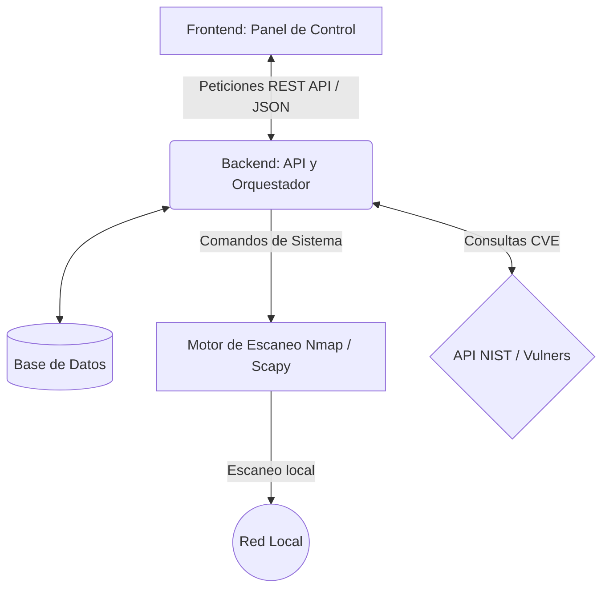
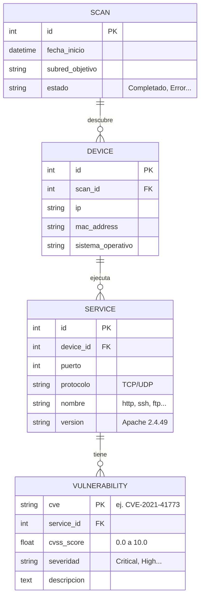

# Propuesta de Proyecto de Título: SecScan

**Plataforma de Descubrimiento y Monitoreo de Vulnerabilidades de Red**

---

## 1. El Problema (¿Por qué es necesario?)
Las pequeñas y medianas empresas (PyMEs), así como las redes domésticas avanzadas, rara vez cuentan con visibilidad sobre los dispositivos conectados a su red y las posibles brechas de seguridad que estos representan. Las herramientas empresariales (como Nessus o Qualys) son costosas y complejas, mientras que las herramientas de línea de comandos (como Nmap) carecen de una interfaz intuitiva y análisis histórico para usuarios sin conocimientos técnicos avanzados. 

**SecScan** busca democratizar la ciberseguridad básica, ofreciendo una plataforma automatizada, de código abierto y visualmente comprensible.

## 2. Objetivos del Proyecto

### **Objetivo General**
Desarrollar una plataforma integral (aplicación web) que permita descubrir dispositivos en una red local, identificar los servicios activos y cruzar dicha información con bases de datos públicas de vulnerabilidades para ofrecer una evaluación de riesgo en tiempo real.

### **Objetivos Específicos**
1. **Descubrimiento:** Implementar un motor de escaneo de red capaz de identificar hosts activos mediante protocolos de descubrimiento (ICMP, ARP).
2. **Reconocimiento:** Escanear puertos abiertos y determinar las versiones y nombres de los servicios corriendo en dichos puertos.
3. **Análisis de Vulnerabilidades:** Integrar una API externa de inteligencia de amenazas (como NIST NVD o Vulners) para relacionar las versiones de los servicios descubiertos con CVEs (Common Vulnerabilities and Exposures) conocidos.
4. **Visualización y Gestión:** Diseñar un Dashboard en frontend que categorice los riesgos mediante un sistema de "semáforo" (Crítico, Alto, Medio, Bajo).
5. **Trazabilidad (Bonus para Título):** Implementar persistencia de datos para mantener un historial de escaneos, permitiendo comparar el estado de la red entre fechas distintas y generar reportes en PDF/CSV.

---

## 3. Arquitectura Propuesta

Para un proyecto de título, es fundamental demostrar buenas prácticas de ingeniería de software. Se propone una **arquitectura en tres capas** (Frontend, Backend, BBDD) totalmente desacoplada.

### **Stack Tecnológico Recomendado**
* **Frontend:** React.js o Vue.js (con TailwindCSS o Material-UI para un diseño moderno y responsivo).
* **Backend:** Python con **FastAPI** (ideal por su velocidad, soporte asíncrono y auto-documentación Swagger) o Flask.
* **Base de Datos:** SQLite (para comenzar) o PostgreSQL (más robusto para el historial de escaneos).
* **Motor de Escaneo:** Librería `python-nmap` (wrapper de Nmap) o `scapy` para un control más fino a nivel de paquetes de red.

---

## 4. Flujo de Trabajo del Usuario (User Journey)

1. **Autenticación (Opcional):** El usuario ingresa al sistema web.
2. **Configuración del Escaneo:** El usuario tiene dos opciones:
   - **Modo Automático:** Un botón de "Escanear mi Red Local" donde el sistema detecta automáticamente su propia subred (ej. la red Wi-Fi o LAN a la que está conectado).
   - **Modo Personalizado (Avanzado):** Un campo opcional para ingresar manualmente un rango de IPs específico (ej. `192.168.1.10-50` o `10.0.0.0/24`) para tener mayor control o escanear otras VLANs.
3. **Procesamiento Asíncrono:** El backend recibe la orden, inicia el escaneo con Nmap en un proceso de fondo (para no bloquear la web) y avisa al frontend cuando termina.
4. **Enriquecimiento del Dato:** El backend toma los resultados de Nmap, extrae las versiones y consulta a la API de vulnerabilidades para mapear los CVEs.
5. **Presentación:** El usuario ve un panel con:
   - Número de hosts activos.
   - Lista cronológica de vulnerabilidades.
   - Gráfico de torta mostrando distribución de criticidad (Crítico, Alto, Medio, Bajo).

---

## 5. Valor agregado para asegurar la aprobación de la tesis
Para que el comité evaluador note la madurez del proyecto, debes enfocarte en:
1. **Manejo de Tareas Asíncronas:** Un escaneo de red puede tardar minutos. Implementar un sistema de colas (ej. Celery + Redis o BackgroundTasks en FastAPI) demuestra un alto nivel técnico.
2. **Sistema de Alertas:** Permitir configurar alertas sencillas si se detecta un riesgo "Crítico" nuevo respecto al escaneo anterior.
3. **Arquitectura Limpia y Código Documentado.**

---

## 6. Modelo de Datos Sugerido (Trazabilidad)
Para que el proyecto tenga el historial de escaneos (y aporte valor a una empresa), la base de datos relacional debe registrar cada descubrimiento. Aquí tienes la estructura recomendada:

Esta estructura te permitirá hacer consultas del tipo: *"Muéstrame todos los dispositivos del escaneo reciente que cuentan con una vulnerabilidad Crítica".*
